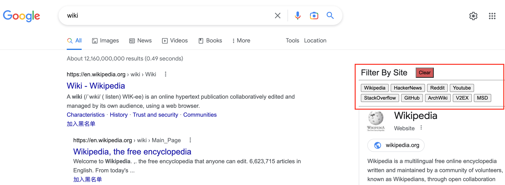

A simple script to make it easier to filter google search results by site. Click an item in the filter list to show results only for that site. The custom site list can be modified in the `sites` variable at the beginning of the script.

